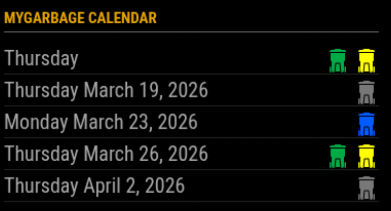

# MMM-MyGarbage
This a module for [Magic Mirror²](https://github.com/MichMich/MagicMirror).
This displays the schedule for your Garbage pickup. It supports multiple types of garbage bins.



## Installation
Clone this repository in your modules folder, and install dependencies:

```
cd ~/MagicMirror/modules 
git clone https://github.com/htilburgs/MMM-MyGarbage.git
cd MMM-MyGarbage
npm install 
```

## Configuration
Go to the MagicMirror/config directory and edit the config.js file.
Add the module to your modules array in your config.js.

```
{
  module: 'MMM-MyGarbage',
  position: 'top_left',
  header: 'My Garbage Calendar',
  config: {
          alert: 4,
          weeksToDisplay: 2,
          limitTo: 99,
          fade: true,
          dateFormat: "dddd D MMMM",
          fadePoint: 0.25
  }
},
```

## Module configuration
Here is the documentation of options for the modules configuration:

<table>
  <thead>
    <tr>
      <th>Option</th>
      <th>Description</th>
    </tr>
  </thead>
  <tbody>
    <tr>
      <td><code>weeksToDisplay</code></td>
      <td>How many weeks into the future to show collection dates.<br /><br /><strong>Number</strong><br />Default: <code>2</code></td>
    </tr>
    <tr>
      <td><code>limitTo</code></td>
      <td>Limit the display to the spcified number of pickups.<br /><br /><strong>Number</strong><br />Default: <code>99</code></td>
    </tr>
    <tr>
      <td><code>dateFormat</code></td>
      <td>Format to use for the date of events <br /><br /><strong>Default: </strong><code>dddd D MMMM</code> (e.g. January 18)<br /><strong>Possible values: </strong>See https://momentjs.com/</td>
    </tr>
    <tr>
      <td><code>alert</code></td>
      <td>(optional) Show alert, if remaining entries in csv file fall under this threshold<br /><br /><strong>Number</strong><br />Default: <code>false</code></td>
    </tr>
    <tr>
      <td><code>fade</code></td>
      <td>Fade the future events to black. (Gradient).<br /><strong><br />Default: </strong><code>true</code><br /><strong>Possible values: </strong><code>true</code> or <code>false</code>
      </td>
    </tr>
        <tr>
      <td><code>fadePoint</code></td>
      <td>Where to start fade?<br /><strong><br />Default: </strong><code>0.25</code><br /><strong>Possible values: </strong><code>0</code> (top of the list) - <code>1</code> (bottom of list)
      </td>
    </tr>
  </tbody>
</table>

### Example config
## Creating and using your Garbage Schedule
You can use this module by creating your own Garbage Schedule file with the name `garbage_schedule.csv` 
An example file `garbage_schedule.csv` is added.

Create a CSV based on the following template:

```
WeekStarting,green,gray,blue
03/07/18,1,0,1
03/14/18,1,1,1
03/21/18,1,0,1
03/28/18,1,1,1
```

Default there are 3 bins defined (green, gray and blue) If you need more garbage bins, simply add an extra column in the `garbage_schedule.csv` file. The name is the color you like the bin to have. 

Add lines for each garbage pickup date as needed.
The date format needs to be specified as `MM/DD/YY` (e.g.: 05/28/18 for 28-May-2018)

Possible Values for colors:
* Legacy Values:
  * GreenBin (defaults to #00A651)
  * GarbageBin (defaults to #787878)
  * PaperBin (defaults to #0059ff)
* Any CSS color string (red, chocolate, cornflowerblue, etc..)
* Any HEX-Color (#FF0000, #8c8c8c, etc)
* Any rgb, rgba or hsl value **if in double quotes** ("rgb(128,65,98)", "rgba(134,56,32,0.5)", "hsl(0, 100%, 50%)", etc.)

The following is **VERY** important:
* The CSV file must be delimited using commas
* The date format needs to be specified as `MM/DD/YY` (e.g.: 05/28/18 for 28-May-2018)
* The remaining fields of each line specify whether the particular waste product is scheduled to be picked up on the given date. A value of `0` means no pick up. A value of ANYTHING ELSE means the product will be picked up.  Using the first pick up date entry in the template above, `1,0,1` means that `green` and `blue` will be picked up on that date, while `gray` will not be picked up.

Save the file as `garbage_schedule.csv` in the `MMM-MyGarbage` directory and restart Magic Mirror²

## License
### The MIT License (MIT)

Copyright © 2019 Harm Tilburgs

Permission is hereby granted, free of charge, to any person obtaining a copy of this software and associated documentation files (the “Software”), to deal in the Software without restriction, including without limitation the rights to use, copy, modify, merge, publish, distribute, sublicense, and/or sell copies of the Software, and to permit persons to whom the Software is furnished to do so, subject to the following conditions:

The above copyright notice and this permission notice shall be included in all copies or substantial portions of the Software.

The software is provided “as is”, without warranty of any kind, express or implied, including but not limited to the warranties of merchantability, fitness for a particular purpose and noninfringement. In no event shall the authors or copyright holders be liable for any claim, damages or other liability, whether in an action of contract, tort or otherwise, arising from, out of or in connection with the software or the use or other dealings in the software.

#### Note
The original script is from Jeff Clarke `MMM-MyWastePickup` and only for the Toronto area.
Now it has become a general script, to use in all areas all over the world. 
